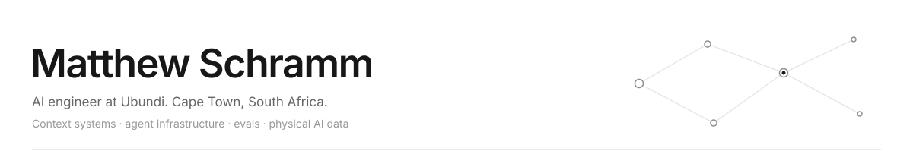

<!--
THESIS: Separate threads become working systems. The work leads; the graphic connects it.
OWN-WORLD: Cobalt field, mint, white and amber interlocking paths; outlined Manrope name.
STORY: Meet Matthew, understand his current work, inspect public projects, compare notes.
FIRST VIEWPORT: Large name left, woven paths right; mobile stacks name above paths. Contact links follow immediately.
FORM: Woven systems, candidate 6, seed 8a96e3a7. Direct SVG implementation.
FINISH: unreviewed and undocumented is unfinished; this build ends with the finish review, the verdict, DESIGN.md, and every shipping raster carrying its provenance
-->

<picture>
  <source media="(max-width: 600px) and (prefers-color-scheme: dark)" srcset="assets/header-mobile-dark.svg" />
  <source media="(max-width: 600px)" srcset="assets/header-mobile-light.svg" />
  <source media="(prefers-color-scheme: dark)" srcset="assets/header-dark.svg" />
  
</picture>

[Portfolio](https://www.mattschramm.com) · [LinkedIn](https://www.linkedin.com/in/matthew-schramm-476523253/) · [Email me](mailto:me@mattschramm.com)

# I build the systems around AI.

The context an agent needs. The memory it can retrieve. The checks that tell us whether it worked. And the product someone can actually use.

I'm **Matthew**, a Graduate AI Engineer at [Ubundi](https://ubundi.com/) in Cape Town. I work across product, engineering, and deployment: turning an unclear idea into working software, then staying with it through releases, customer setup, and daily use.

## What I'm building

**Ayda · Company knowledge that agents can use** 
My main focus. I help build and ship an AI assistant that answers from a company's own knowledge, cites its sources, and respects each person's access. I manage releases and hosting across six company deployments, build connectors, and help customers get to their first useful answer.

**Agents & memory · Context that lasts beyond a chat** 
I built Cortex, a long-term agent memory system that combines structured facts, a knowledge graph, and several retrieval methods. I also build deployment tools and integrations, and keep company agents running day to day. Running my own agents is part of how I learn where these systems fail.

**First Motive · Robot demonstrations into usable datasets** 
I built data processing, quality checks, annotation, and storage workflows for robot and human recordings. My current role centres on processing and improving robot demonstration data: review, provenance, and checked datasets for the team's training workflow.

## Work you can explore

[**Atrium**](https://github.com/Schramm2/Atrium) 
Native macOS workspace for meetings, notes, and company context. On-device transcription, local dictation, and explicit controls for external AI requests.

[**ProjectForge**](https://github.com/Schramm2/projectforge) 
A CLI that turns requirements and team conventions into Python and TypeScript projects through coding agents.

[**Umbono**](https://github.com/Schramm2/umbono-dashboard) 
Compare model outputs side by side and score them against custom evaluation criteria.

[**Resonate showcase**](https://github.com/Schramm2/resonate-showcase) 
Structured communication identity, text transformation, and a visible correction trace. A deterministic demo with synthetic data.

[**Personal Codex showcase**](https://github.com/Schramm2/personal-codex-agent-showcase) 
A personal RAG interface with response modes, document workflows, and source attribution. A deterministic demo with synthetic data.

## How I work

**Use AI fully. Keep human judgment.** I use Claude Code, Codex, and my own agents to explore and build. I stay responsible for the result.

**Make the evidence visible.** Sources, evaluation results, data provenance, and repeatable checks belong in the workflow.

**Follow through.** A feature also needs a release, a usable interface, and someone who can operate it.

<strong>Tools I reach for</strong>

- **Build:** Python, TypeScript, React / Next.js, PostgreSQL, APIs.
- **AI:** agents, MCP, retrieval, memory, evaluations, OpenAI, Anthropic, AWS Bedrock.
- **Ship:** AWS, Terraform, Docker, CI/CD, OAuth integrations.
- **Robot data:** ROS 2, MCAP, LeRobot datasets, SmolVLA data preparation.

## A little beyond the code

I studied Computer Science and Information Systems at **UCT**, then completed **Information Systems Honours with distinction**. My thesis explored why young people share data online despite privacy concerns.

I also volunteer as a tutor in **Langa**, teaching computer skills and beginner coding. Explaining something clearly is a good test of how well I understand it.

My earlier student projects are still here. They show where the work started.

---

**Working on agent memory, context systems, evaluations, or robot data?** 
I'd like to compare notes. [Get in touch](mailto:me@mattschramm.com) or [see more of my work](https://www.mattschramm.com).
