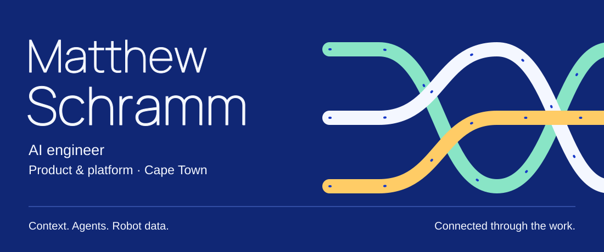

<picture>
  <source media="(prefers-color-scheme: dark)" srcset="assets/header-dark.svg" />
  <source media="(prefers-color-scheme: light)" srcset="assets/header-light.svg" />
  
</picture>

<p align="right">
  <a href="https://www.mattschramm.com">mattschramm.com</a>
  &nbsp;·&nbsp;
  <a href="https://www.linkedin.com/in/matthew-schramm-476523253/">LinkedIn</a>
  &nbsp;·&nbsp;
  <a href="mailto:matthew@ubundi.co.za">matthew@ubundi.co.za</a>
</p>

I build the practical layer around AI: agents, context, memory, internal tools, and the evaluation loops that tell you whether any of it is actually working.

I studied Computer Science and Information Systems at UCT and work as a graduate AI engineer at [Ubundi](https://ubundi.com/) in Cape Town. My work has two connected centers. At Ubundi I build AI products and the agent, context, and reliability infrastructure behind them. On [First Motive](https://firstmotive.ai), Ubundi's physical AI venture, I work on the data engine that turns real robot demonstrations into training data worth trusting.

The belief underneath all of it: **AI should amplify judgment, not replace it.** The interesting problems are rarely the model. They are context, trust, verification, and keeping a human accountable for the result.

<br />

## Right now

```text
role            Graduate AI engineer · Ubundi
based           Cape Town, South Africa · UTC+2
education       BCom Computer Science + Information Systems · IS Honours, UCT
core            Context systems · agent infrastructure · evals · internal tools
shipping        First Motive's physical AI data pipeline: capture, processing,
                quality, provenance, annotation, and release evidence
also building   Context and retrieval systems that ground AI in what an
                organisation actually knows
side project    An AI-native operating system for my own work and thinking
open question   How much of a person's working context can software safely carry?
```

<br />

## Physical AI data

Physical AI is short on trustworthy demonstration data, not models. On First Motive my lane is making captured robot data reviewable and usable for training: processing pipelines, quality checks, provenance, annotation workflows, and the evaluation evidence that decides what is good enough to release. The public ROS 2 stack lives in the [first-motive](https://github.com/first-motive) organisation.

<br />

## Selected work

| Repo | What it is |
|---|---|
| [**umbono-dashboard**](https://github.com/Schramm2/umbono-dashboard) | Model-comparison and evaluation dashboard for scoring AI outputs against custom criteria. |
| [**resonate**](https://github.com/Schramm2/resonate) | AI writing platform that models a user's communication identity and rewrites output to match their voice. |
| [**Local-Context-Engine**](https://github.com/Schramm2/Local-Context-Engine) | Privacy-first local RAG. Offline ingestion, retrieval, and hallucination evaluation with nothing leaving the machine. |
| [**projectforge**](https://github.com/Schramm2/projectforge) | AI-powered project scaffolding with team conventions baked in from the first commit. |
| [**personal-codex-agent**](https://github.com/Schramm2/personal-codex-agent) | A candidate-context chatbot built on profile data, CV material, and embeddings. |
| [**rent-a-ryde-web-app**](https://github.com/Schramm2/rent-a-ryde-web-app) | Full-stack rental workflow: Vue, Firebase auth, bookings, and admin operations. |

<details>
  <summary><b>What is not public</b></summary>

<br />

Most of my current work is internal to Ubundi and First Motive: agent infrastructure, context and memory systems, evaluation harnesses, and the data-quality tooling above. The pattern generalises even when the code cannot: strong context first, verification built in, humans kept in the loop.

</details>

<br />

## Tools

| | |
|---|---|
| Languages | Python · TypeScript · JavaScript · Java · SQL |
| AI systems | Agents · RAG · context engineering · evals · embeddings |
| Robotics data | ROS 2 · MCAP · trajectory and annotation pipelines |
| Frontend | React · Next.js · Vue · Angular |
| Backend and data | Node.js · Spring · PostgreSQL · MySQL · Supabase · Firebase |
| Infrastructure | Docker · AWS · Vercel · GitHub Actions |

<br />

## Signal

<picture>
  <source media="(prefers-color-scheme: dark)" srcset="https://raw.githubusercontent.com/Schramm2/Schramm2/output/github-snake-dark.svg" />
  <source media="(prefers-color-scheme: light)" srcset="https://raw.githubusercontent.com/Schramm2/Schramm2/output/github-snake.svg" />
  
</picture>

<sub>The fuller story is in the pinned repos and the contribution graph below. Older learning, newer AI systems, compounding.</sub>

<br />
<br />

## Notes to self

<details>
  <summary><b>How I think about AI</b></summary>

<br />

I do not want AI to replace the thinking part of my work. I want it to make the thinking more visible, more structured, and more ambitious. The best AI-assisted work still needs a human who knows what matters, notices when something is wrong, and takes responsibility for the final result.

</details>

<details>
  <summary><b>What building at Ubundi is teaching me</b></summary>

<br />

The hard part is rarely the model. It is context, trust, workflow design, observability, secure boundaries, and knowing when a human needs to stay in the loop. Production AI engineering is mostly the engineering around the AI, and the last mile between AI capability and real operational value is where the work is.

</details>

<details>
  <summary><b>Why the old code is still here</b></summary>

<br />

This account merged my student and personal GitHub identities. The early repos are not my sharpest work, but they are the path, and keeping the path visible is the point.

</details>

<br />

<p align="center">
  <sub>
    <a href="https://www.mattschramm.com">mattschramm.com</a>
    &nbsp;·&nbsp;
    <a href="https://www.linkedin.com/in/matthew-schramm-476523253/">LinkedIn</a>
    &nbsp;·&nbsp;
    <a href="mailto:matthew@ubundi.co.za">matthew@ubundi.co.za</a>
  </sub>
</p>
